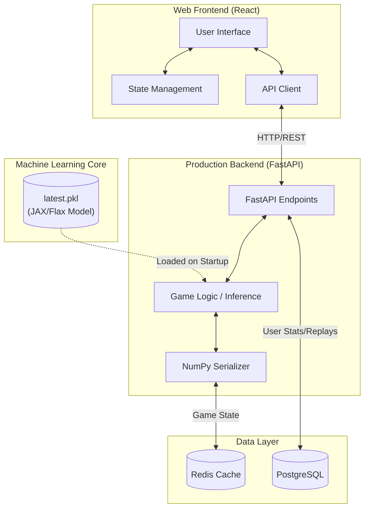

# UNO RL Arena: Full-Stack AI & Multiplayer Platform

UNO RL Arena is a high-performance reinforcement learning project featuring a highly scalable, vectorized UNO environment, coupled with a production-ready Web API and a modern interactive Web Frontend.

The repository includes an advanced Proximal Policy Optimization (PPO) training pipeline built with JAX and Flax, paired with a low-latency, stateless asynchronous inference API (FastAPI) and a sleek React (Vite) frontend for playing against the AI.

---

## 🚀 Key Features

### Machine Learning Core (JAX/Flax)
- **JAX-Accelerated Environment:** Fully vectorized, tensor-native implementation of UNO rules (including Wild, Draw Four, Skip, Reverse) for massive parallel rollout collection.
- **GTrXL Memory Architecture:** A recurrent UNO agent utilizing Gated Transformer-XL (GTrXL) layers for robust sequential decision-making.
- **Token Self-Attention:** Dynamic card-hand embeddings utilizing self-attention pooling to support variable hand sizes (`N ≤ 32`).
- **League Training Framework:** Automated Elo rating tracking, historical self-play, and annealed reward shaping to maximize policy convergence and exploitability resistance.

### Production Backend (FastAPI)
- **FastAPI Inference Server:** Stateless, concurrent web API wrapping the trained `RecurrentUNOAgent` with pre-compiled JIT warmup for instant first-turn inference.
- **Redis State Management:** High-speed game state and TrXL memory carry caching using optimized NumPy-to-bytes serialization (Pickle Protocol 5).
- **PostgreSQL Database:** Persistent storage for user statistics, game history, and multiplayer matches.
- **Dockerized Deployment:** Multi-stage Docker Compose setup combining the Frontend, API, Redis, and PostgreSQL for scalable deployment.

### Modern Web Frontend (React + Vite)
- **Interactive Gameplay:** Play UNO directly against the trained RL Agent in your browser.
- **Responsive UI & Animations:** Built with Tailwind CSS, Framer Motion, and Radix UI primitives for a premium, highly responsive user experience.
- **State Management:** Utilizes Zustand for lightweight, fast global state management.
- **Data Visualization:** Integrated Recharts for visualizing agent statistics, win rates, and Elo ratings over time.

---

## 📂 Repository Structure

```text
.
├── backend/              # FastAPI Application & Backend Services
│   ├── app/
│   │   ├── api/          # Endpoints (auth, game, multiplayer, replay, stats)
│   │   ├── core/         # Config and Redis clients
│   │   ├── db/           # PostgreSQL Database models and connection
│   │   └── game/         # Game wrapper and inference logic
│   ├── Dockerfile
│   └── requirements.txt
│
├── frontend/             # React + Vite Web Application
│   ├── src/
│   │   ├── api/          # Axios client and API wrappers
│   │   ├── components/   # Reusable UI components (Cards, Modals)
│   │   ├── pages/        # Application views (Game, Settings, Stats)
│   │   └── store/        # Zustand state stores
│   ├── package.json
│   ├── tailwind.config.js
│   └── Dockerfile
│
├── checkpoints/          # Agent model checkpoints (e.g., latest.pkl)
├── uno_jax.py            # ML Training Script (PPO, Evaluation, Saliency)
└── docker-compose.yml    # Full-stack container orchestration
```

---

## 🛠️ Installation & Deployment

### Prerequisites
- Docker & Docker Compose
- Python 3.11+ (for local training/backend development)
- Node.js 18+ (for local frontend development)

### Quick Start (Docker)

1. **Ensure a trained checkpoint exists:**
   ```bash
   mkdir -p checkpoints
   # Make sure latest.pkl is present inside checkpoints/
   ```

2. **Build and start all services:**
   ```bash
   docker-compose up --build -d
   ```

3. **Access the application:**
   - **Frontend UI:** `http://localhost:80` (or port configured in compose)
   - **Backend API Docs:** `http://localhost:8000/docs`

---

## 💻 Local Development

### Backend Setup

```bash
cd backend
python -m venv venv
source venv/bin/activate  # On Windows: venv\Scripts\activate
pip install -r requirements.txt
uvicorn app.main:app --reload
```

### Frontend Setup

```bash
cd frontend
npm install
npm run dev
```

---

## 🧠 Training & ML Pipeline

The RL training script is located in the root directory (`uno_jax.py`).

**Launch PPO training:**
```bash
python uno_jax.py train \
    --output-dir checkpoints \
    --num-envs 64 \
    --rollout-len 32 \
    --total-updates 4000 \
    --hidden-dim 192 \
    --memory-len 12
```

**Evaluate a Checkpoint:**
```bash
python uno_jax.py eval --checkpoint checkpoints/latest.pkl --episodes 100
```

---

## 📊 Architecture Diagram



---

## 📦 Technology Stack

| Category | Technologies |
|-----------|--------------|
| **Frontend** | React, Vite, Tailwind CSS, Framer Motion, Zustand |
| **Backend** | FastAPI, Uvicorn, SQLAlchemy, asyncpg |
| **ML / RL** | JAX, Flax, PPO, GTrXL |
| **Database & Cache**| PostgreSQL, Redis |
| **Deployment** | Docker, Docker Compose |

---

## 📄 License

This project is intended for research and educational purposes. Add your preferred open-source license (MIT, Apache 2.0, GPL, etc.) before public distribution.
